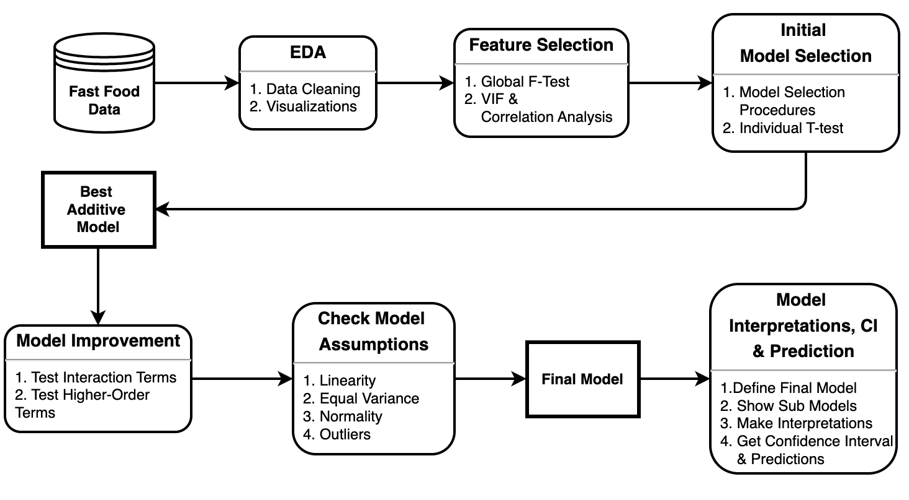

\vspace{20em}


\begin{center}
\large  \textbf{L-01 Group 9:}

{\large Itunuoluwa Olowoye (UCID: 30184712)\\
Eisha Imran Chaudhry (UCID: 30263099)\\
Vrinda (UCID: 30270428)\\
Israel Maikyau (UCID: 30269917)}
\end{center}

\vfill

\begin{center}
\large{DATA 603 Project Report}
\end{center}

\newpage

## 1. Introduction

\vspace{2em}

### 1.1. Motivation

#### 1.1.1. Context

$~$

This project focuses on examining the nutritional value of fast food using menu items from selected fast food restaurants as samples. Eating food away from home (FAFH), particularly fast food, is a prevalent practice in Canada and is associated with poorer dietary habits. This includes lower intakes of essential nutrients such as fruits, vegetables, and whole grains, while there is higher consumption of fats, sodium, and sugars (Polsky & Garriguet, 2021). This makes understanding the nutritional content of fast food items more crucial, especially considering the broader societal challenges related to diet and health highlighted by Marcone et al. (2020).

\newpage

#### 1.1.2. Problem 

$~$

How can we make informed dietary choices when it comes to fast food? Fast food restaurants offer easily accessible meals, but they also come with concerns about their high calorie and processed fat content. As evident, the nutritional quality of home-cooked meals is not reflected in that of fast food, and the choice of eating fast food is influenced by socio-environmental factors like affordability, accessibility, and convenience (Marcone et al., 2020). Considering some of these factors are unavoidable, addressing these issues with informed decisions is a public health priority, given the increasing reliance on fast food.

\newpage

#### 1.1.3. Challenges

$~$

Even though fast food is a convenient option, its frequent consumption can lead to several health issues, such as obesity, diabetes, and heart disease. In Canada, approximately 1 in 8 households experience food insecurity, which can lead to lower-cost food options that contribute to poor nutritional outcomes (Marcone et al., 2020).
Public health discussions about the long-term impacts of fast food are necessary to guide policy changes aimed at improving nutritional standards within the fast-food industry.

\vspace{2em}

\newpage

### 1.2. Objectives 

#### 1.2.1. Overview

$~$

While there has been a growing recognition of the health risks that are associated with fast food consumption, there still remains a significant gap in addressing food insecurity and making nutritious food more accessible and affordable (Marcone et al., 2020). By understanding the relationship between nutrients and calorie content, the project aims to give consumers more transparency and help them make healthier choices when selecting fast food menu items.

\newpage

#### 1.2.2. Goals & Research Questions

$~$

The goal is to construct a robust predictive model that can help quantify the calorie value of fast food based on commonly known nutrients. This project aims to provide useful insights which could inform initiatives aimed at improving transparency within the fast-food industry, leading to the development of healthier menu options.

For this project, we will be exploring three research questions:

1. What is the calorie content distribution for different food categories and in different fast food restaurants?
2. Trans Fats form when hydrogen is added to vegetable oil. This is done to increase shelf life but is bad for our health and the FDA is forcing food companies to phase them out. Is there a significant difference in the average trans fat content of menu items in the selected fast food restaurants?
3. Can we establish a linear relationship between calories and the nutritional content of various items on the menu of different fast food restaurants?

\newpage


## 2. Methodology

\vspace{2em}

### 2.1. Data

The dataset used in this project, the Fast Food Nutrition Dataset, was web-scraped from the Fast Food Nutrition Facts website (Fast Food Nutrition Facts, n.d.). This dataset was originally available on Kaggle (Arvidsson, 2023), but some of the rows in the data contained misrepresentations of values (also noticed by other individuals in the discussion), which we considered undesirable for our analysis. 

The data was collected through a web scraping method and is representative of a sample of fast food restaurants in Canada. This means the sample is not randomly selected but rather manually chosen. This also introduces a potential selection bias as it limits the analysis to specific restaurants that may not be fully representative of the entire fast food industry in Canada.

Each row in the dataset provides a detailed breakdown of the nutrient and calorie values of menu items from the selected fast-food restaurants. The geographical scope of the data is limited to the Canada. It includes **745 rows and 28 columns**, out of which we will use **24 columns** comprising **23 predictor variables** and **1 response variable**.The predictor variables are described in **Table 1** below.

\vspace{2em}

**Table 1** 

_Predictor Variables_

| **S/N** | **Predictor Variable** | **Variable Type** | **Unit** |
|:--------|:-------------------------|:-------------------|:---------|
| 1                     | Company                   | Qualitative        | No units |
| 2                     | Calories From Fat        | Quantitative       | kcals    |
| 3                     | Total Fat (g)            | Quantitative       | grams    |
| 4                     | Saturated Fat (g)        | Quantitative       | grams    |
| 5                     | Trans Fat (g)            | Quantitative       | grams    |
| 6                     | Cholesterol (mg)         | Quantitative       | milligrams |
| 7                     | Sodium (mg)               | Quantitative       | milligrams |
| 8                     | Total Carbohydrates (g)  | Quantitative       | grams    |
| 9                     | Dietary Fiber (g)        | Quantitative       | grams    |
| 10                    | Sugars (g)                | Quantitative       | grams    |
| 11                    | Protein (g)               | Quantitative       | grams    |
| 12                    | Total Fat (% Daily Value) | Quantitative       | percentage |
| 13                    | Saturated Fat (% Daily Value) | Quantitative       | percentage |
| 14                    | Cholesterol (% Daily Value) | Quantitative       | percentage |
| 15                    | Sodium (% Daily Value)     | Quantitative       | percentage |
| 16                    | Total Carbohydrates (% Daily Value) | Quantitative       | percentage |
| 17                    | Dietary Fiber (% Daily Value) | Quantitative       | percentage |
| 18                    | Protein (% Daily Value)     | Quantitative       | percentage |
| 19                    | Vitamin A (% Daily Value)   | Quantitative       | percentage |
| 20                    | Vitamin C (% Daily Value)   | Quantitative       | percentage |
| 21                    | Calcium (% Daily Value)     | Quantitative       | percentage |
| 22                    | Iron (% Daily Value)        | Quantitative       | percentage |
| 23                    | Category                     | Qualitative        | No units |
_Note._ This table presents the predictor variables, their variable types, and units that will be used in the analysis.

The _Response Variable_ in the scope of this project is **Calories** (Quantitative, calories).

\vspace{2em}

\newpage

### 2.2. Approach

For the research questions about calorie content distribution for different food categories and in different fast food restaurants, we will visualize with bar charts and box plots the difference between the calorie content of different companies and different food categories. We will do the same with understanding the difference in the average trans fat content of menu items in the selected restaurants.

For establishing a linear relationship between calories and nutritional content, we will build a **multiple linear regression model** between calories and the different nutrients. 

\newpage

### 2.3. Workflow

1. We load the required R libraries, load and clean the data
2. We visualize the average calories of different food categories
3. We visualize the calorie distibution of different fast food restaurants
4. We examine the trans fat content of menu items from these different fast food restaurants
5. We build a _multiple linear regression model_ of the effect of nutrients, company, and food category on calories, using the following steps. We are employing this method because the variable of interest, calories, is quantitative and we want to assess whether there are relationships between this variable and many other variables (nutrients, company, food category):
  + Feature Selection: Define dependent variables, predictor variables, and assess multicolinearity between predictor variables using the variance inflation factor (VIF).
  + Perform Stepwise Selection, Forward, Backward and All-Possible-Regressions Selection Procedures to select a starting model. 
  + Verify the starting model using the Individual T-test. The Individual T-test helps to calculate individual p values for predictors we can compare with chosen significance level. Our **significance level** $\alpha$ **= 0.05**
  + Perform model improvement tasks such as including interaction and higher-order terms to improve the model.
  + Select a valid model for prediction with proof of why this is the best choice.
  + Validate model assumptions (Linearity, equal variance and normality assumptions) and detect (or remove) any outliers that may significantly affect the model.
  + Perform model transformations, if needed, when the model assumptions are violated.


**Figure 1** 

_Workflow Diagram_



_Note._ This workflow diagram outlines the key steps involved in the model development process for the fast food nutrition analysis project.

\newpage

### 2.4 Contributions

1. Eisha:

EDA (Exploratory Data Analysis)

- Data cleaning: Handle missing values, detect outliers, and check data types.
- Generate summary statistics: Summary of all variables.
- Visualize distributions: Histograms, box plots, scatter plots, and pair plots.
- Check correlations: Between numeric variables.

2. Israel:

Feature Selection

- Correlation analysis: Identify highly correlated features.
- Feature importance ranking: Use domain knowledge and EDA
- Statistical methods: Feature selection based on p-values.

3. Vrinda:

Full Additive Model and Partial Model Tests

- Develop a full regression model: Use all selected features.
- Test partial model: Use a reduced set of features.
- Generate predictions: Compare model performance.

4. Itunuoluwa:

Interaction Model or Higher-Order Model, Model Selection & Validation

- Interaction model or Higher order model: Build a model with interaction or higher-order terms.
- Select best model for prediction from valid models.
- Validate model assumptions.
- Interpret selected model, if interpretation is not lost.


\newpage

## 3. Main Results of the Analysis

First the required R libraries and the dataset are loaded. Then we proceed to clean the data.

```{r, message=FALSE, echo=FALSE, warning=FALSE, include=FALSE}
library(mosaic)
library(ggformula)
library(readr)
library(ggplot2)
library(gridExtra)
library(corrplot)
library(janitor)
library(mctest)
library(olsrr)
library(GGally)
library(lmtest)
library(knitr)
library(leaps)

options(scipen = 999)
set.seed(2021)

theme_set(theme_bw()) # change theme for ggplot2
trellis.par.set(theme=theme.mosaic()) # change default color scheme for lattice

knitr::opts_chunk$set(
  tidy=FALSE,    
  size="small")

fast_food_df = read.csv('FastFoodNutritionScraped20241011.csv')
```

\vspace{2em}

**Table 2** 

_Head of Dataset_

```{r, echo=FALSE}
kable(head(fast_food_df[, 1:6]), format = "latex", longtable = TRUE)
```

_Note._ This table presents the first six rows of a dataset that includes a few columns, showcasing how the variable names are currently stored in the data.

\vspace{2em}

The column names are converted to snake case and then we validate the calories data by filtering out any item whose calorie value is greater than the calories from fat. The new column names are shown in the R output below.

\vspace{2em}

```{r, echo=FALSE}
fast_food_df = fast_food_df %>% janitor::clean_names() %>% filter(calories >= calories_from_fat)
cat('The columns in the data include:\n')
colnames(fast_food_df)
```

\newpage

#### 3.0.1. Calorie content distribution in different fast food restaurants

$~$

First we aim to assess Calorie content distribution in different fast food restaurants. we do this by plotting ta box plot and violin plot to see the distributions based on each company (using the ggplot library).

\vspace{2em}

**Figure 2** 

_Violin Plot & Box plot of Calorie Content Distribution_

```{r, echo=FALSE}
# visualization to see how calories is different based on company
calories_violin_plot = ggplot(fast_food_df,
                               aes(x = company,y = calories, fill=company)) +
  geom_violin(alpha = 0.7) +
  geom_boxplot(width = 0.1, fill = "white", color = "black") +
  labs(title = "Calorie Content by Restaurant",
       x = NULL, y = "Calories", fill = "Company")
print(calories_violin_plot)
```

_Note._ This figure presents a violin plot and box plot of the calorie content distribution for different fast food restaurants. The x-axis shows the different restaurant companies, and the y-axis displays the calorie content in calories. 

\vspace{2em}

Diary Queen has certain menu items with more calories compared to the other fast food restaurants, causing its calorie distribution to be skewed to the right compared to others. In terms of median calorie content, Tim Hortons has the lowest, followed by A&W, McDonalds, Subway, and Dairy Queen respectively.

\newpage

#### 3.0.2. Average Calories Content of different food categories

$~$

Next we aim to get the Average Calories Content of different food categories. We calculate the average calorie content for each food category using the dplyr library, sort the categories by their average calorie values, and visualize the results using a horizontal bar chart created with ggplot to highlight the differences in calorie content across categories.

\vspace{2em}

**Figure 3** 

_Average Calories Content per Category_

```{r, echo=FALSE}
# calculate average calories per category
avg_calories = fast_food_df %>% group_by(category) %>%
  summarise(average_calories = mean(calories, na.rm = TRUE) )%>%
  arrange(average_calories)

# Convert Category to a factor to preserve sorted order in the plot
avg_calories$category <- factor(avg_calories$category, levels = avg_calories$category)

# visualization to see average calories per category
avg_category_calories = ggplot(avg_calories, aes(y = category, x = average_calories)) +
  geom_bar(stat = "identity", fill='blue') +
  labs(title = "Average Calories per Category", x = "Average Calories", y=NULL)

print(avg_category_calories)
```

_Note._ This figure presents the average calorie content per menu category for a restaurant or food provider. The categories are displayed vertically, and the corresponding average calorie content is shown on the horizontal axis. 

\vspace{2em}

Blizzards and Rice Wraps contain more than 800 calories, on average. Timbits contain the lowest calories on average. 

There are some categories that are peculiar to certain companies, for example, blizzards are peculiar to Dairy Queen, Rice Wraps are peculiar to Subway, and Timbits to Tim Hortons. There are also categories that contain similar menu items such as Chicken Strips, Chicken, Chicken McNuggets etc but are set into different categories by the different fast food restaurants.

\newpage

#### 3.0.3. Trans fat Content in Different Fast Food restaurants

$~$

We aim to assess the content of these unhealthy Trans fats across various restaurants; therefore, we will examine the trans fat content of menu items from these different establishments.

**Figure 4** 

_Trans fat Content by Restaurant_

```{r, echo=FALSE}
# visualization to see how trans fat is different based on company
trans_fat_violin_plot = ggplot(fast_food_df,
                               aes(x = company,y = trans_fat_g, fill=company)) +
  geom_violin(alpha = 0.7) +
  geom_boxplot(width = 0.1, fill = "white", color = "black") +
  labs(title = "Trans Fat Content by Restaurant",
       x = "company", y = "Trans Fat (g)", fill = "company")
print(trans_fat_violin_plot)
```

_Note._ This figure presents a bar chart depicting the trans fat content for different fast food restaurant chains. The x-axis shows the company names, while the y-axis displays the trans fat content in grams per serving. 

\vspace{2em}

The types of fats found in food include: 

**Unsaturated Fat**: These are the good fat which doctors say should be the fat people eat most. They come as liquid oils instead of solid fats. On food packages, they are listed as mono or poly unsaturated fats.

**Saturated Fat**: These fats come from animals and are generally solid. They contain "bad" cholesterol and can contribute to heart disease. It is recommended that they make up less than 10% of dail caloric intake. Examples include whole-fat milk, butter, high-fat cheeses etc.

**Trans Fat**: These are the worst fats, and the FDA is forcing food companies to phase them out. They form when hydrogen is added to vegetable oil. This is done to increase shelf life but are bad for our health. Examples of food more likely to contain trans fat include stick margarine, pie crusts, ready-to-use frosting, some microwave popcorn and frozen pizza, etc.

From the visualization It looks like these companies are making efforts to phase out Trans Fat since their central tendencies are less than 0.5g. All of these companies have outliers with items that have more than 1g of trans fat.

McDonald's has the highest median trans fat content compared to the others. The median trans fat content for A&W, Diary Queen, and Subway is closest to 0g. Perhaps we can consider menu items from them as a "healthier" alternative to McDonald's and Tim Hortons.

#### 3.0.4. Global F-Test

$~$

Anova to check the interaction model and Higher Order Model Against the Best Additive Model

$$H_0 : \beta_i = 0 \text{ vs } H_a : \beta_i \neq 0 \text { (i = 1, 2, 3 ... ) }$$ 

```{r, echo=FALSE}
mlr_df = fast_food_df %>% select(-item, -free_style_points, -smart_points, -points_plus)
FullModel = lm(formula = calories ~ ., data = mlr_df)
caloriesReducedModel = lm(calories ~ 1, data = mlr_df)
```

```{r , echo=FALSE}
print(anova(caloriesReducedModel, FullModel))
```

\vspace{2em}

**Table 3** 

_Anova Table for Interaction Model and Additive Model_

|Source of Var.| Deg. of Freedom | Sum of Sqrs. |Mean Sqrs. 	| F-Stat |
|:------------:|:---------------:|:------------:|:-----------:|:------:|
| Regression   |      12         | 53695688       | 4474640.67 | 7832.164|
| Residual     |   729           | 416489       | 571.316 | -       |
| Total        |   741           | 54112178       | -     	| -       |

_Note._ This table presents an ANOVA (Analysis of Variance) summary for the interaction model and additive model. It contains the Sources of Variation (Regression, Residual, and Total), the Degrees of Freedom and Sum of Squares associated with each Source of Variation, the Mean Squares and  F-statistic.

With a p-value < 0.00000000000000022 < 0.05 we **reject** the null hypothesis $H_0$ at $\alpha = 0.05$. Therefore, at least one of the predictors is significant to our model.

\vspace{2em}

#### 3.0.5. VIF & Colinearity

$~$

The dependent variable is `Calories`. The predictor variables are the nutritional content, company name, and food category. These are listed in Section 2.1. We create a model with these variables and calculate the VIF to assess multicolinearity.

$$
\begin{aligned}
VIF({\hat{\beta_j}})=\frac{1}{1-R^2_{X_j|X_{-j}}}
\end{aligned}
$$

- VIFs=1 indicates that there is no collinearity between this independent variable and any others. 
- $1\leq VIFs \leq 5$  suggest that there is a moderate collinearity, but it is not severe enough to warrant corrective measures. 
- $VIFs > 5$ or 10 represent critical levels of multicollinearity.

```{r, echo=FALSE}
imcdiag(FullModel, method="VIF")
```

\vspace{2em}

The VIF test detected colinearity. We will resolve this by removing predictors that are highly correlatable with one another. For the categorical predictors, there are certain food categories that are unique to only one company, e.g. Blizzards in Dairy Queen, Timbits in Tim Hortons etc. These can cause 1-1 relationships in some of the company sub-modules and category sub-modules causing colinearity between categories and companies. Since the categories are not standard across companies, we will remove the category column and keep the company column.

For the numeric predictors, we will use pair plots and correlation matrices to determine the predictors that are highly correlatable with each other (using a correlation cutoff of 0.8 or 80%) and select one either based on domain knowledge or the predictor that has the highest correlation with the dependent variable.

\vspace{2em}

**Figure 5** 

_Pair Plot between Dependent and Predictor variable_

```{r pairs-plt, fig.width=10, fig.height=10, echo=FALSE}
mlr_df_numeric = mlr_df %>% select(-company, -category)
pairs(~., data=mlr_df_numeric, panel=panel.smooth)
```

_Note._ This figure presents a pair plot of the dependent calorie variable against all the nutrient predictors.

\vspace{2em}

**Figure 6** 

_Correlation Matrix between Dependent and Predictor variable_

```{r corrplot-plt, fig.width=20, fig.height=20, echo=FALSE}
# Compute correlation matrix
cor_matrix <- cor(mlr_df_numeric, use = "complete.obs", method='pearson')
# Heat map of the correlation matrix
corrplot(cor_matrix, method = "color", type = "upper", tl.col = "black",
         tl.srt = 45,
         col = colorRampPalette(c("darkolivegreen3", "white",
                                  "aquamarine4"))(200),
         addCoef.col = "black", addCoefasPercent = TRUE)
```

_Note._ This figure presents a correlation Matrix between the dependent calorie variable against all the nutrient predictors.


- *Calories from Fat* is highly correlated with *total fat*, *saturated fat*, *total fat daily value*, and *saturated fat daily value*. Of these five predictors, we will use **total fat** which has the highest correlation with Calories among the others.
- *Cholesterol* and its *percentage daily value* have a 1-1 relationship. We will use the **cholesterol** nutrient value instead as it is a direct figure of the content of the menu item.
- *Sodium* is highly correlated with *protein*, *Sodium % daily value*, and *protein % daily value*. Of these, we will use **protein** which has the highest correlation with Calories among the others and is also a major food nutrient.
- *Total carbohydrates* is highly correlated with *sugars* and *Total carbohydrates % daily value*. Of these, we will use **Total carbohydrates** since it has the highest correlation with calories among the others and is a major food nutrient.

**In summary**, the predictors to be used for the full additive model are: **company**, **total_fat_g**, **trans_fat_g**, **cholesterol_mg**, **total_carbohydrates_g**, **dietary_fiber_g**, **protein_g**, **vitamin_a_daily_value**, **vitamin_c_daily_value**, **calcium_daily_value**, and **iron_daily_value**.


#### 3.0.6. Full Additive Model Analysis: Stepwise, Forward, Backward, All-Possible-Regressions, Individual T-test

$~$

We will use the predictors selected after the VIF test to build the first full model. First, we use the Stepwise, All-Possible-Regressions Selection procedures, and individual t-test to select a model.

\vspace{2em}

- Using **Stepwise Regression Procedure**, p_enter=0.05, p_remove=0.1

```{r, echo=FALSE}
fullAdditiveModel = lm(calories ~ company + total_fat_g + trans_fat_g + cholesterol_mg +
                         total_carbohydrates_g + dietary_fiber_g + protein_g +
                         vitamin_a_daily_value + vitamin_c_daily_value +
                         calcium_daily_value + iron_daily_value, data = mlr_df)
stepmod = ols_step_both_p(fullAdditiveModel, p_enter=0.05, p_remove=0.1, details=FALSE)
summary(stepmod$model)
```

According to the stepwise regression procedure, the "best" set of predictors for calories are: total_fat_g, total_carbohydrates_g, protein_g, trans_fat_g, iron_daily_value, calcium_daily_value, dietary_fiber_g, company, and vitamin_a_daily_value.

\vspace{2em}

- Using the **Forward Selection Regression Procedure**, p_val = 0.05

```{r, echo=FALSE}
forwardmod=ols_step_forward_p(fullAdditiveModel, p_val = 0.05, details=FALSE)
summary(forwardmod$model)
```

According to the foward selection procedure, the "best" set of predictors for calories are: total_fat_g, total_carbohydrates_g, protein_g, trans_fat_g, iron_daily_value, calcium_daily_value, dietary_fiber_g, company, and vitamin_a_daily_value.

\vspace{2em}

- Using the **Backward Elimination Regression Procedure**, p_val = 0.05

```{r, echo=FALSE}
backwardmod=ols_step_backward_p(fullAdditiveModel, p_val = 0.05, details=FALSE)
summary(backwardmod$model)
```

According to the backward elimination procedure, the "best" set of predictors for calories are: total_fat_g, total_carbohydrates_g, protein_g, trans_fat_g, iron_daily_value, calcium_daily_value, dietary_fiber_g, company, and vitamin_a_daily_value.

\vspace{2em}

- Using the **All-Possible-Regressions Selection Procedure (with AIC)**,

```{r, echo=FALSE}
fullAdditiveModelSubsets = ols_step_best_subset(fullAdditiveModel, details = TRUE)
Predictors = fullAdditiveModelSubsets$metrics$predictors
Aic = fullAdditiveModelSubsets$metrics$aic
AdjR = fullAdditiveModelSubsets$metrics$adjr
cbind(Predictors, AdjR, Aic)
```
Based on AIC, we need to pick the model subset with the smallest value of AIC. Using this criterion, the "best" predictors of Calories with the lowest AIC value of 6830.76302060874 are 9 variables: company, total_fat_g, trans_fat_g, total_carbohydrates_g, dietary_fiber_g, protein_g, vitamin_a_daily_value, calcium_daily_value, and iron_daily_value.

Based on adjusted R-squared, we need to pick the model subset with the highest value of adjusted R-squared. Using this criterion, the "best" predictors of Calories with the highest adjusted $R^2$ value of 0.992182223668979 are 10 variables: company, total_fat_g, trans_fat_g, cholesterol_mg, total_carbohydrates_g, dietary_fiber_g, protein_g, vitamin_a_daily_value, calcium_daily_value, and iron_daily_value.

\vspace{2em}

- Using the **All-Possible-Regressions Selection Procedure (with BIC)**

```{r, echo=FALSE}
subsetModel=regsubsets(calories ~ company + total_fat_g + trans_fat_g + cholesterol_mg +
                         total_carbohydrates_g + dietary_fiber_g + protein_g +
                         vitamin_a_daily_value + vitamin_c_daily_value +
                         calcium_daily_value + iron_daily_value, data = mlr_df, nv=11 ) 

subsetModelSum = summary(subsetModel)
subsetModelSum
BIC=c(subsetModelSum$bic)
cbind(BIC)

```

Based on BIC, we need to pick the model subset with the smallest value of BIC. Using this criterion, the "best" predictors of Calories with the lowest BIC value of -3535.0676 are 8 variables: company, total_fat_g, trans_fat_g, total_carbohydrates_g, dietary_fiber_g, protein_g, calcium_daily_value, and iron_daily_value.

\vspace{2em}

- Using the **Individual t-test** method,

The null hypothesis, $H_o$ and the alternate hypothesis, $H_a$ are as follows:
$$
\begin{aligned}
H_o&: \beta_k = 0 \\
H_a&: \beta_k \neq 0 \ (k=1,2,...,11) 
\end{aligned}
$$

```{r, echo=FALSE}
tTestModel = lm(calories ~ company + total_fat_g + trans_fat_g + cholesterol_mg +
                  total_carbohydrates_g + dietary_fiber_g + protein_g + 
                  vitamin_a_daily_value + vitamin_c_daily_value + calcium_daily_value + 
                  iron_daily_value,
                data = mlr_df)
summary(tTestModel)
```

Based on the t-test with a significance level of 0.05, the "best" predictors of Calories are company, total_fat_g, trans_fat_g, total_carbohydrates_g, dietary_fiber_g, protein_g, vitamin_a_daily_value, calcium_daily_value, and iron_daily_value.

Comparing the results, there are 9 independent variables that are consistently selected as the "best" predictors confirmed by the Individual T-Test, Stepwise Regression, Forward Selection, Backward Selection and AIC. They are **company**, **total_fat_g**, **trans_fat_g**, **total_carbohydrates_g**, **dietary_fiber_g**, **protein_g**, **vitamin_a_daily_value**, **calcium_daily_value**, and **iron_daily_value**.

\vspace{2em}

- The final **best additive model** is shown below:

```{r, echo=FALSE}
# best additive model
caloriesAdditiveModel = lm(calories ~ total_fat_g + total_carbohydrates_g + protein_g +
                             trans_fat_g + iron_daily_value + calcium_daily_value +
                             dietary_fiber_g + company + vitamin_a_daily_value,
                           data = mlr_df)
summary(caloriesAdditiveModel)
```

\vspace{2em}

#### 3.0.7. Interaction Model

$~$

To improve the first order model, we will build an interaction model on the additive model and perform an individual t-test (with significance level of 0.05) on the independent predictors and interaction terms.

$$
\begin{aligned}
H_o&:\beta_i=0\\
H_a&:\beta_i\neq0\mbox{    (i=1,2,...,p)}
\end{aligned}
$$

where $p$ is the number of independent variables and interaction terms in the regression model.

```{r, include=FALSE}
interacModel = lm(calories ~ (total_fat_g + total_carbohydrates_g + protein_g +
                             trans_fat_g + iron_daily_value + calcium_daily_value +
                             dietary_fiber_g + company + vitamin_a_daily_value)^2,
                           data = mlr_df)
summary(interacModel)
```

```{r, include=FALSE}
interacModelv2 = lm(calories ~ total_fat_g + total_carbohydrates_g + protein_g +
                      trans_fat_g + iron_daily_value + calcium_daily_value +
                      dietary_fiber_g + company + vitamin_a_daily_value +
                      total_fat_g:total_carbohydrates_g + total_fat_g:calcium_daily_value +
                      total_fat_g:company + total_fat_g:vitamin_a_daily_value +
                      total_carbohydrates_g:trans_fat_g +
                      total_carbohydrates_g:iron_daily_value +
                      total_carbohydrates_g:calcium_daily_value +
                      total_carbohydrates_g:vitamin_a_daily_value +
                      protein_g:iron_daily_value + protein_g:calcium_daily_value +
                      trans_fat_g:iron_daily_value + trans_fat_g:vitamin_a_daily_value +
                      iron_daily_value:calcium_daily_value +
                      iron_daily_value:dietary_fiber_g + iron_daily_value:company +
                      iron_daily_value:vitamin_a_daily_value +
                      calcium_daily_value:dietary_fiber_g + calcium_daily_value:company +
                      dietary_fiber_g:company,
                           data = mlr_df)
summary(interacModelv2)
```

```{r, echo=FALSE}
caloriesInteracModel = lm(calories ~ total_fat_g + total_carbohydrates_g + protein_g +
                      trans_fat_g + iron_daily_value + calcium_daily_value +
                      dietary_fiber_g + company + vitamin_a_daily_value +
                      total_fat_g:total_carbohydrates_g + total_fat_g:calcium_daily_value +
                      total_fat_g:company + total_fat_g:vitamin_a_daily_value +
                      total_carbohydrates_g:trans_fat_g +
                      total_carbohydrates_g:iron_daily_value +
                      total_carbohydrates_g:calcium_daily_value +
                      total_carbohydrates_g:vitamin_a_daily_value +
                      protein_g:calcium_daily_value +
                      trans_fat_g:iron_daily_value + trans_fat_g:vitamin_a_daily_value +
                      iron_daily_value:dietary_fiber_g + iron_daily_value:company +
                      calcium_daily_value:dietary_fiber_g + calcium_daily_value:company +
                      dietary_fiber_g:company,
                           data = mlr_df)
summary(caloriesInteracModel)
```

\vspace{1em}

#### 3.0.8. Higher Order Model

$~$

For further model improvement procedures, we check for the effect of higher-order terms in the model, starting from the predictor with highest correlation to the dependent variable, `Calories`.

**Figure 7** 

_Pair Plot between Dependent and Predictor variable for Higher Order_

```{r, echo=FALSE, message=FALSE, warning=FALSE}
yCorrDf = mlr_df %>% select(calories, total_fat_g, total_carbohydrates_g, protein_g,
                             trans_fat_g, iron_daily_value, calcium_daily_value,
                             dietary_fiber_g, company, vitamin_a_daily_value)
ggpairs(yCorrDf,lower = list(continuous = "smooth_loess",
                             combo = "facethist", discrete = "facetbar", na = "na"),
        cardinality_threshold=30)
```

```{r, include=FALSE}
higherOrderModel = lm(calories ~ total_fat_g + I(total_fat_g^2) + total_carbohydrates_g + protein_g +
                      trans_fat_g + iron_daily_value + calcium_daily_value +
                      dietary_fiber_g + company + vitamin_a_daily_value +
                      total_fat_g:total_carbohydrates_g + total_fat_g:calcium_daily_value +
                      total_fat_g:company + total_fat_g:vitamin_a_daily_value +
                      total_carbohydrates_g:trans_fat_g +
                      total_carbohydrates_g:iron_daily_value +
                      total_carbohydrates_g:calcium_daily_value +
                      total_carbohydrates_g:vitamin_a_daily_value +
                      protein_g:calcium_daily_value +
                      trans_fat_g:iron_daily_value + trans_fat_g:vitamin_a_daily_value +
                      iron_daily_value:dietary_fiber_g + iron_daily_value:company +
                      calcium_daily_value:dietary_fiber_g + calcium_daily_value:company +
                      dietary_fiber_g:company,
                           data = mlr_df)
summary(higherOrderModel)
```

```{r, include=FALSE}
higherOrderModelv2 = lm(calories ~ total_fat_g + I(total_carbohydrates_g^2) + total_carbohydrates_g + protein_g +
                      trans_fat_g + iron_daily_value + calcium_daily_value +
                      dietary_fiber_g + company + vitamin_a_daily_value +
                      total_fat_g:total_carbohydrates_g + total_fat_g:calcium_daily_value +
                      total_fat_g:company + total_fat_g:vitamin_a_daily_value +
                      total_carbohydrates_g:trans_fat_g +
                      total_carbohydrates_g:iron_daily_value +
                      total_carbohydrates_g:calcium_daily_value +
                      total_carbohydrates_g:vitamin_a_daily_value +
                      protein_g:calcium_daily_value +
                      trans_fat_g:iron_daily_value + trans_fat_g:vitamin_a_daily_value +
                      iron_daily_value:dietary_fiber_g + iron_daily_value:company +
                      calcium_daily_value:dietary_fiber_g + calcium_daily_value:company +
                      dietary_fiber_g:company,
                           data = mlr_df)
summary(higherOrderModelv2)
```

```{r, echo=FALSE}
CaloriesHigherOrderModel = lm(calories ~ total_fat_g + total_carbohydrates_g + I(total_carbohydrates_g^2)  + protein_g +
                      trans_fat_g + iron_daily_value + calcium_daily_value +
                      dietary_fiber_g + company + vitamin_a_daily_value +
                      total_fat_g:calcium_daily_value +
                      total_fat_g:vitamin_a_daily_value +
                      total_carbohydrates_g:trans_fat_g +
                      total_carbohydrates_g:iron_daily_value +
                      total_carbohydrates_g:calcium_daily_value +
                      total_carbohydrates_g:vitamin_a_daily_value +
                      protein_g:calcium_daily_value +
                      trans_fat_g:iron_daily_value + trans_fat_g:vitamin_a_daily_value +
                      iron_daily_value:dietary_fiber_g + iron_daily_value:company +
                      calcium_daily_value:dietary_fiber_g + calcium_daily_value:company +
                      dietary_fiber_g:company,
                           data = mlr_df)
summary(CaloriesHigherOrderModel)
```

```{r, include=FALSE}
higherOrderModelv4 = lm(calories ~ total_fat_g + total_carbohydrates_g + I(total_carbohydrates_g^2) + I(total_carbohydrates_g^3)  + protein_g +
                      trans_fat_g + iron_daily_value + calcium_daily_value +
                      dietary_fiber_g + company + vitamin_a_daily_value +
                      total_fat_g:calcium_daily_value +
                      total_fat_g:vitamin_a_daily_value +
                      total_carbohydrates_g:trans_fat_g +
                      total_carbohydrates_g:iron_daily_value +
                      total_carbohydrates_g:calcium_daily_value +
                      total_carbohydrates_g:vitamin_a_daily_value +
                      protein_g:calcium_daily_value +
                      trans_fat_g:iron_daily_value + trans_fat_g:vitamin_a_daily_value +
                      iron_daily_value:dietary_fiber_g + iron_daily_value:company +
                      calcium_daily_value:dietary_fiber_g + calcium_daily_value:company +
                      dietary_fiber_g:company,
                           data = mlr_df)
summary(higherOrderModelv4)
```

```{r, include=FALSE}
higherOrderModelv5 = lm(calories ~ total_fat_g + total_carbohydrates_g + I(total_carbohydrates_g^2) + protein_g + I(protein_g^2) +
                      trans_fat_g + iron_daily_value + calcium_daily_value +
                      dietary_fiber_g + company + vitamin_a_daily_value +
                      total_fat_g:calcium_daily_value +
                      total_fat_g:vitamin_a_daily_value +
                      total_carbohydrates_g:trans_fat_g +
                      total_carbohydrates_g:iron_daily_value +
                      total_carbohydrates_g:calcium_daily_value +
                      total_carbohydrates_g:vitamin_a_daily_value +
                      protein_g:calcium_daily_value +
                      trans_fat_g:iron_daily_value + trans_fat_g:vitamin_a_daily_value +
                      iron_daily_value:dietary_fiber_g + iron_daily_value:company +
                      calcium_daily_value:dietary_fiber_g + calcium_daily_value:company +
                      dietary_fiber_g:company,
                           data = mlr_df)
summary(higherOrderModelv5)
```

```{r, include=FALSE}
higherOrderModelv6 = lm(calories ~ total_fat_g + total_carbohydrates_g + I(total_carbohydrates_g^2) + protein_g +
                      trans_fat_g + iron_daily_value + calcium_daily_value + I(calcium_daily_value^2) +
                      dietary_fiber_g + company + vitamin_a_daily_value +
                      total_fat_g:calcium_daily_value +
                      total_fat_g:vitamin_a_daily_value +
                      total_carbohydrates_g:trans_fat_g +
                      total_carbohydrates_g:iron_daily_value +
                      total_carbohydrates_g:calcium_daily_value +
                      total_carbohydrates_g:vitamin_a_daily_value +
                      protein_g:calcium_daily_value +
                      trans_fat_g:iron_daily_value + trans_fat_g:vitamin_a_daily_value +
                      iron_daily_value:dietary_fiber_g + iron_daily_value:company +
                      calcium_daily_value:dietary_fiber_g + calcium_daily_value:company +
                      dietary_fiber_g:company,
                           data = mlr_df)
summary(higherOrderModelv6)
```

```{r, include=FALSE}
higherOrderModelv7 = lm(calories ~ total_fat_g + total_carbohydrates_g + I(total_carbohydrates_g^2) + protein_g +
                      trans_fat_g + I(trans_fat_g^2) + iron_daily_value + calcium_daily_value +
                      dietary_fiber_g + company + vitamin_a_daily_value +
                      total_fat_g:calcium_daily_value +
                      total_fat_g:vitamin_a_daily_value +
                      total_carbohydrates_g:trans_fat_g +
                      total_carbohydrates_g:iron_daily_value +
                      total_carbohydrates_g:calcium_daily_value +
                      total_carbohydrates_g:vitamin_a_daily_value +
                      protein_g:calcium_daily_value +
                      trans_fat_g:iron_daily_value + trans_fat_g:vitamin_a_daily_value +
                      iron_daily_value:dietary_fiber_g + iron_daily_value:company +
                      calcium_daily_value:dietary_fiber_g + calcium_daily_value:company +
                      dietary_fiber_g:company,
                           data = mlr_df)
summary(higherOrderModelv7)
```

```{r, include=FALSE}
higherOrderModelv8 = lm(calories ~ total_fat_g + total_carbohydrates_g + I(total_carbohydrates_g^2) + protein_g +
                      trans_fat_g + iron_daily_value + I(iron_daily_value^2)  + calcium_daily_value +
                      dietary_fiber_g + company + vitamin_a_daily_value +
                      total_fat_g:calcium_daily_value +
                      total_fat_g:vitamin_a_daily_value +
                      total_carbohydrates_g:trans_fat_g +
                      total_carbohydrates_g:iron_daily_value +
                      total_carbohydrates_g:calcium_daily_value +
                      total_carbohydrates_g:vitamin_a_daily_value +
                      protein_g:calcium_daily_value +
                      trans_fat_g:iron_daily_value + trans_fat_g:vitamin_a_daily_value +
                      iron_daily_value:dietary_fiber_g + iron_daily_value:company +
                      calcium_daily_value:dietary_fiber_g + calcium_daily_value:company +
                      dietary_fiber_g:company,
                           data = mlr_df)
summary(higherOrderModelv8)
```

```{r, include=FALSE}
higherOrderModelv9 = lm(calories ~ total_fat_g + total_carbohydrates_g + I(total_carbohydrates_g^2) + protein_g +
                      trans_fat_g + iron_daily_value + calcium_daily_value +
                      dietary_fiber_g + I(dietary_fiber_g^2)  + company + vitamin_a_daily_value +
                      total_fat_g:calcium_daily_value +
                      total_fat_g:vitamin_a_daily_value +
                      total_carbohydrates_g:trans_fat_g +
                      total_carbohydrates_g:iron_daily_value +
                      total_carbohydrates_g:calcium_daily_value +
                      total_carbohydrates_g:vitamin_a_daily_value +
                      protein_g:calcium_daily_value +
                      trans_fat_g:iron_daily_value + trans_fat_g:vitamin_a_daily_value +
                      iron_daily_value:dietary_fiber_g + iron_daily_value:company +
                      calcium_daily_value:dietary_fiber_g + calcium_daily_value:company +
                      dietary_fiber_g:company,
                           data = mlr_df)
summary(higherOrderModelv9)
```


The step-by-step process from additive to higher order model building can be found in the appendix for reproducibility.


#### 3.0.9. Model Selection

$~$

Comparing the residual standard error (RSE) and Adjusted R-squared of the valid additive, interaction, and higher-order models respectively:

1. Additive Model: RSE is 23.9, Adjusted R-squared is 0.9922.
2. Interaction Model: RSE is 20.38, Adjusted R-squared is 0.9943.
3. Higher Order Model: RSE is 20.34, Adjusted R-squared is 0.9943.

While the interaction and higher-order models reduced the RSE by more than 3 points, the adjusted R-squared value changed very slightly.

In order to avoid overfitting as the adjusted R-squared is almost perfect (~99%), we will be selecting the additive model as the model for predictions.

With the additive model:

- 99.22% of the variation in Calories is explained by the regression model which depends on the total fat (g), total carbohydrates (g), protein (g), trans fat (g), iron % daily value, calcium % daily value, dietary fiber (g), company, and vitamin A % daily value.
- the average difference between the fitted values from the regression model and the actual observed values is 23.9 calories.

\vspace{2em}

#### 3.0.10. Validation of Model Assumptions

$~$

We will validate the additive model for linearity, equal variance, and normality.


##### Linearity Assumption

$~$

Plotting the residual vs fitted values plot,

**Figure 8** 

_Residual vs Fitted values_

```{r, echo=FALSE}
plot(caloriesAdditiveModel, which = 1)
```

The model follows a fairly normal line and passes the assumption of linearity.

\vspace{1em}

##### Equal Variance Assumption

$~$

Visualizing the scale-location plot,

**Figure 9** 

_Scale-Location Plot_

```{r, echo=FALSE}
plot(caloriesAdditiveModel, which = 3)
```

Conducting the Breusch- Pagan Test to test the following hypothesis:

$$
\begin{aligned}
H_0:&\mbox{ heteroscedasticity is not present (homoscedasticity)}\\
H_a~:&\mbox{ heteroscedasticity is present} \\
or \\
H_0:& \sigma^2_1=\sigma^2_2=...=\sigma^2_n\\
H_0:& \mbox{ at least one }\sigma^2_i\mbox{ is different from the others } i=1,2,...,n
\end{aligned}
$$

```{r, echo=FALSE}
bptest(caloriesAdditiveModel)
```

At a significance level of 0.05, we reject the null hypothesis and conclude that heteroscedasticity is present.

\vspace{2em}

##### Normality Assumption

$~$

From the Q-Q plot,

**Figure 10** 

_Q-Q Plot_

```{r, echo=FALSE}
plot(caloriesAdditiveModel, which = 2)
```

Using the Shapiro-Wilk test (S-W):

$$
\begin{aligned}
H_0:&\mbox{ the sample data are significantly normally distributed}\\
H_a:&\mbox{ the sample data are not significantly normally distributed } \\
\end{aligned}
$$

```{r, echo=FALSE}
shapiro.test(residuals(caloriesAdditiveModel))
```

At a significance level of 0.05, we reject the null hypothesis that we have normality.

\vspace{2em}

##### Outliers

$~$

We also check to see whether there are any significant outliers in the model.

**Figure 11** 

_Cooks Distance Plot to Identify Outliers_

```{r, echo=FALSE}
plot(caloriesAdditiveModel, which=5)
```

All standardized residuals in the model lie within the Cook's distance less than 0.5 so we can conclude that there are no outliers that will significantly change the output of the model.

\newpage

### 3.1. Results

1. Menu items from Tim Hortons have the lowest calorie distribution compared to A&W, McDonals, Diary Queen, and Subway.
2. The median trans fat content for A&W, Diary Queen, and Subway is closest to 0g. Perhaps we can consider menu items from them as a "healthier" alternative to McDonald's and Tim Hortons.
3. Calories can be explained by the regression model which depends on the total fat (g), total carbohydrates (g), protein (g), trans fat (g), iron % daily value, calcium % daily value, dietary fiber (g), company, and vitamin A % daily value.
 - The equation is as follows:
 
 $$
\begin{aligned}
\hat{\text{calories}} = & \ 8.90307 + 8.46865 \cdot total\_fat\_g + 4.04566 \cdot total\_carbohydrates\_g + 4.07397 \cdot protein\_g  \\
& + 14.94406 \cdot trans\_fat\_g + 0.45175 \cdot iron\_daily\_value - 0.15480 \cdot calcium\_daily\_value \\
& - 1.52016 \cdot dietary\_fiber\_g - 17.58979 \cdot companydairy\_queen \\
& - 8.90787 \cdot companymcdonalds - 9.06995 \cdot companysubway \\
& - 9.48100 \cdot companytim\_hortons - 0.23617 \cdot vitamin\_a\_daily\_value
\end{aligned}$$ 

\vspace{2em}

The Submodels are given below

**For Company A&W**

\[
\begin{aligned}
\hat{\text{calories}} = & \ 8.90307 + 8.46865 \cdot total\_fat\_g + 4.04566 \cdot total\_carbohydrates\_g + 4.07397 \cdot protein\_g \\
& + 14.94406 \cdot trans\_fat\_g + 0.45175 \cdot iron\_daily\_value - 0.15480 \cdot calcium\_daily\_value \\
& - 1.52016 \cdot dietary\_fiber\_g - 0.23617 \cdot vitamin\_a\_daily\_value
\end{aligned}
\]

**For Company Dairy Queen**

\[
\begin{aligned}
\hat{\text{calories}} = & \ 8.90307 + 8.46865 \cdot total\_fat\_g + 4.04566 \cdot total\_carbohydrates\_g + 4.07397 \cdot protein\_g  \\
& + 14.94406 \cdot trans\_fat\_g + 0.45175 \cdot iron\_daily\_value - 0.15480 \cdot calcium\_daily\_value \\
& - 1.52016 \cdot dietary\_fiber\_g - 17.58979 \cdot companydairy\_queen - 0.23617 \cdot vitamin\_a\_daily\_value
\end{aligned}
\]

**For Company Mcdonalds**

\[
\begin{aligned}
\hat{\text{calories}} = & \ 8.90307 + 8.46865 \cdot total\_fat\_g + 4.04566 \cdot total\_carbohydrates\_g +  4.07397 \cdot protein\_g \\
& + 14.94406 \cdot trans\_fat\_g + 0.45175 \cdot iron\_daily\_value - 0.15480 \cdot calcium\_daily\_value \\
& - 1.52016 \cdot dietary\_fiber\_g - 8.90787 \cdot companymcdonalds  - 0.23617 \cdot vitamin\_a\_daily\_value
\end{aligned}
\]

**For company Subway**

\[
\begin{aligned}
\hat{\text{calories}} = & \ 8.90307 + 8.46865 \cdot total\_fat\_g + 4.04566 \cdot total\_carbohydrates\_g + 4.07397 \cdot protein\_g \\
& + 14.94406 \cdot trans\_fat\_g + 0.45175 \cdot iron\_daily\_value - 0.15480 \cdot calcium\_daily\_value \\
& - 1.52016 \cdot dietary\_fiber\_g  - 9.06995 \cdot companysubway - 0.23617 \cdot vitamin\_a\_daily\_value
\end{aligned}
\]

**For Company Tim-Horton**

\[
\begin{aligned}
\hat{\text{calories}} = & \ 8.90307 + 8.46865 \cdot total\_fat\_g + 4.04566 \cdot total\_carbohydrates\_g + 4.07397 \cdot protein\_g \\
& + 14.94406 \cdot trans\_fat\_g + 0.45175 \cdot iron\_daily\_value - 0.15480 \cdot calcium\_daily\_value \\
& - 1.52016 \cdot dietary\_fiber\_g  - 9.48100 \cdot companytim\_hortons - 0.23617 \cdot vitamin\_a\_daily\_value
\end{aligned}
\]

\vspace{2em}

- The interpretation is as follows:

1. **8.90307** represents the baseline calories when all other predictors (e.g., total fat, protein) are zero.
2. For every additional gram of total fat by keeping all other predictors constant, the calorie count  **increases** by **8.47** calories.
3. For every additional gram of carbohydrate by keeping all other predictors constant, the calorie count  **increases** by **4.05** calories.
4. For every additional gram of protein by keeping all other predictors constant, the calorie count **increases** by **4.07** calories.
5. For every additional gram of trans fat by keeping all other predictors constant, the calorie count **increases** by **14.94** calories.
6. For every 1% increase in the daily value of iron by keeping all other predictors constant, the calorie count **increases** by **0.45** calories.
7. For every 1% increase in the daily value of calcium by keeping all other predictors constant, the calorie count **decreases** by **0.15** calories.
8. For every additional gram of dietary fiber by keeping all other predictors constant, the calorie count **decreases** by **1.52** calories.
9. For every 1% increase in the daily value of Vitamin A by keeping all other predictors constant, the calorie count **decreases** by **0.24** calories.

10. Foods from Dairy Queen tend to have **17.59** fewer calories compared to the A&W by keeping all other predictors constant.
11. Foods from McDonald's have **8.91** fewer calories compared to the A&W by keeping all other predictors constant.
12. Foods from Subway have **9.07** fewer calories compared to the A&W by keeping all other predictors constant.
13. Foods from Tim Hortons have **9.48** fewer calories compared to the A&W by keeping all other predictors constant.


\vspace{2em}

 
### 3.2. Model Prediction and Confidence Interval

#### 3.2.1. Confidence Interval

$~$

 
```{r, echo=FALSE}
confint(caloriesAdditiveModel, level = 0.95)
``` 
 
Sample: Dietary Fiber, Total Carbohydrate:

-   The 95% confidence interval for regression coefficient for dietary_fiber_g is (-0.26460728, -0.26460728). This means that we conclude 95% confidence that for every $\textbf{1 gram}$ increase in dietary_fiber_g, the calories **decreases** between **0.26460728** and **0.26460728** calories while holding the total_fat_g, total_carbohydrates_g, protein_g, trans_fat_g, iron_daily_value, calcium_daily_value, company and vitamin_a_daily_value constant. 

- The 95% confidence interval for regression coefficient for total_carbohydrates_g is (-3.9796420, -4.11168641). This means that we conclude 95% confidence that for every $\textbf{1 gram}$ increase in total_carbohydrates_g, the calories **increases** between **3.9796420** and **4.11168641** calories while holding the total_fat_g, protein_g, trans_fat_g, iron_daily_value, calcium_daily_value, dietary_fiber_g, company and vitamin_a_daily_value constant. 

#### 3.2.2. Prediction

$~$
 
```{r, echo=FALSE}
# Final Model
caloriesAdditiveModel = lm(calories ~ total_fat_g + total_carbohydrates_g + protein_g +
                             trans_fat_g + iron_daily_value + calcium_daily_value +
                             dietary_fiber_g + company + vitamin_a_daily_value,
                           data = mlr_df)
```

- We can get a range of the values for prediction:

```{r, echo=FALSE}
range(mlr_df$total_fat_g)
range(mlr_df$total_carbohydrates_g)
range(mlr_df$protein_g)
range(mlr_df$trans_fat_g)
range(mlr_df$iron_daily_value)
range(mlr_df$calcium_daily_value)
range(mlr_df$dietary_fiber_g)
range(mlr_df$company)
range(mlr_df$vitamin_a_daily_value)
```

- or alternatively we can select a particular row in the data to test the models accuracy:

```{r, echo=FALSE}
mlr_df[32, ]
```

For the Single Mozza Burger menu item from A&W with these content values - Total Fat = 39g, Total Carbohydrates = 37g, Protein = 27g, Trans Fat = 1g, Iron Daily Value = 25%, Calcium Daily Value = 20%, dietary_fiber_g = 1g, Vitamin A Daily Value = 8% our model predicts:

```{r, echo=FALSE}
# Actual Calorie = 620
newData = data.frame(total_fat_g = 39, total_carbohydrates_g = 37, protein_g = 27, trans_fat_g = 1, iron_daily_value = 25, calcium_daily_value = 20, dietary_fiber_g = 1, company= "a-w", vitamin_a_daily_value = 8)
predict(caloriesAdditiveModel,newdata = newData,interval = "predict")
```

- The predicted calorie is **618.5995 calories.**
- The 95% prediction interval of calories content for the fast food with the given nutrients is between **571.2563**  and **665.9428** calories.

\newpage
 
## 4. Conclusion and Discussion

### 4.1. Approach

The approach is promising as we were able to create a multiple linear regression model that explained ~99% of the variability in Calories of menu items with a 23.9 calorie-difference between the fitted values and actual observed values.

Another variant of this approach can consider using even lesser predictors because from the stepwise selection process, the adjusted R-squared was as good as 97.5% using only the total fat and total carbohydrates predictors and reached 99% after adding the protein predictor.

\newpage

### 4.2. Future Work

Follow-up work can be done to ensure that the selected model meets equal variance assumptions either through:
- Box-Cox transformations: These work when the dependent variable values are all positive. We will need to explore menu items with 0 calories and determine whether they are significant to be kept in the data for the model. If they are not, we can remove them and perform Box-Cox transformations. If they are, then we can consider another approach such as
- Weighted Least Squares Regression

\newpage

## References

1. Marcone, M. F., Madan, P., & Grodzinski, B. (2020). An overview of the sociological and environmental factors influencing eating food behavior in Canada. Frontiers in Nutrition, 7, 77. https://doi.org/10.3389/fnut.2020.00077

2. Polsky, J. Y., & Garriguet, D. (2021). Eating away from home in Canada: Impact on dietary intake. Health Reports, 32(8), 26-34. https://doi.org/10.25318/82-003-x202100800003-eng

3. Fast Food Nutrition. (n.d.). Canada - Fast food nutrition facts. Fast Food Nutrition. Retrieved from https://fastfoodnutrition.org/ca/

4. Arvidsson, J. (2023). Fast food nutrition: Nutritional values, micronutrients, and calories from six fast food restaurants [Dataset]. Kaggle. https://www.kaggle.com/datasets/joebeachcapital/fast-food

5. Lipman, D. (2023). MRModelPart1-Part4: Multiple linear regression [Lecture notes]. In Data603: Statistical Modelling with Data. University of Calgary. Based on content created by T. Ngamkham. Retrieved from https://d2l.ucalgary.ca/

6. Statsig. (2024, July 3). Understanding significance levels: A key to accurate data analysis. Retrieved from https://www.statsig.com/perspectives/understanding-significance-levels-a-key-to-accurate-data-analysis

\newpage

## Appendix

```{r message = FALSE, warning = FALSE}
library(mosaic)
library(ggformula)
library(readr)
library(ggplot2)
library(gridExtra)
library(corrplot)
library(janitor)
library(mctest)
library(olsrr)
library(GGally)
library(lmtest)
library(knitr)
library(leaps)

options(scipen = 999)
set.seed(2021)

theme_set(theme_bw()) # change theme for ggplot2
trellis.par.set(theme=theme.mosaic()) # change default color scheme for lattice

knitr::opts_chunk$set(
  tidy=FALSE,    
  size="small")

fast_food_df = read.csv('FastFoodNutritionScraped20241011.csv')
#head(fast_food_df)

#kable(head(fast_food_df[, 1:6]), format = "latex", longtable = TRUE)

fast_food_df = fast_food_df %>% janitor::clean_names() %>% filter(calories >= calories_from_fat)
#cat('The columns in the data include:\n')
#colnames(fast_food_df)
calories_violin_plot = ggplot(fast_food_df,
                               aes(x = company,y = calories, fill=company)) +
  geom_violin(alpha = 0.7) +
  geom_boxplot(width = 0.1, fill = "white", color = "black") +
  labs(title = "Calorie Content by Restaurant",
       x = NULL, y = "Calories", fill = "Company")
# calculate average calories per category
avg_calories = fast_food_df %>% group_by(category) %>%
  summarise(average_calories = mean(calories, na.rm = TRUE) )%>%
  arrange(average_calories)

# Convert Category to a factor to preserve sorted order in the plot
avg_calories$category <- factor(avg_calories$category, levels = avg_calories$category)

# visualization to see average calories per category
avg_category_calories = ggplot(avg_calories, aes(y = category, x = average_calories)) +
  geom_bar(stat = "identity", fill='blue') +
  labs(title = "Average Calories per Category", x = "Average Calories", y=NULL)
# visualization to see how trans fat is different based on company
trans_fat_violin_plot = ggplot(fast_food_df,
                               aes(x = company,y = trans_fat_g, fill=company)) +
  geom_violin(alpha = 0.7) +
  geom_boxplot(width = 0.1, fill = "white", color = "black") +
  labs(title = "Trans Fat Content by Restaurant",
       x = "company", y = "Trans Fat (g)", fill = "company")
mlr_df = fast_food_df %>% select(-item, -free_style_points, -smart_points, -points_plus)
FullModel = lm(formula = calories ~ ., data = mlr_df)
caloriesReducedModel = lm(calories ~ 1, data = mlr_df)

#print(anova(caloriesReducedModel, FullModel))

FullModel = lm(formula = calories ~ ., data = mlr_df)
#imcdiag(FullModel, method="VIF")
mlr_df_numeric = mlr_df %>% select(-company, -category)
#pairs(~., data=mlr_df_numeric, panel=panel.smooth)
# Compute correlation matrix
cor_matrix <- cor(mlr_df_numeric, use = "complete.obs", method='pearson')
# Heat map of the correlation matrix
#corrplot(cor_matrix, method = "color", type = "upper", tl.col = "black",         tl.srt = 45,         col =colorRampPalette(c("darkolivegreen3", "white",                                  "aquamarine4"))(200),         addCoef.col = "black", addCoefasPercent = TRUE)

fullAdditiveModel = lm(calories ~ company + total_fat_g + trans_fat_g + cholesterol_mg +
                         total_carbohydrates_g + dietary_fiber_g + protein_g +
                         vitamin_a_daily_value + vitamin_c_daily_value +
                         calcium_daily_value + iron_daily_value, data = mlr_df)
#stepmod = ols_step_both_p(fullAdditiveModel, p_enter=0.05, p_remove=0.1, details=TRUE)
#summary(stepmod$model)

#forwardmod=ols_step_forward_p(fullAdditiveModel, p_val = 0.05, details=FALSE)
#summary(forwardmod$model)

#backwardmod=ols_step_backward_p(fullAdditiveModel, p_val = 0.05, details=FALSE)
#summary(backwardmod$model)

fullAdditiveModelSubsets = ols_step_best_subset(fullAdditiveModel, details = TRUE)
Predictors = fullAdditiveModelSubsets$metrics$predictors
Aic = fullAdditiveModelSubsets$metrics$aic
AdjR = fullAdditiveModelSubsets$metrics$adjr
#cbind(Predictors, AdjR, Aic)

subsetModel=regsubsets(calories ~ company + total_fat_g + trans_fat_g + cholesterol_mg +
                         total_carbohydrates_g + dietary_fiber_g + protein_g +
                         vitamin_a_daily_value + vitamin_c_daily_value +
                         calcium_daily_value + iron_daily_value, data = mlr_df, nv=11 ) 

subsetModelSum = summary(subsetModel)
subsetModelSum
BIC=c(subsetModelSum$bic)
#cbind(BIC)

tTestModel = lm(calories ~ company + total_fat_g + trans_fat_g + cholesterol_mg +
                  total_carbohydrates_g + dietary_fiber_g + protein_g + 
                  vitamin_a_daily_value + vitamin_c_daily_value + calcium_daily_value + 
                  iron_daily_value,
                data = mlr_df)
#summary(tTestModel)
caloriesAdditiveModel = lm(calories ~ total_fat_g + total_carbohydrates_g + protein_g +
                             trans_fat_g + iron_daily_value + calcium_daily_value +
                             dietary_fiber_g + company + vitamin_a_daily_value,
                           data = mlr_df)
#summary(caloriesAdditiveModel)
interacModel = lm(calories ~ (total_fat_g + total_carbohydrates_g + protein_g +
                             trans_fat_g + iron_daily_value + calcium_daily_value +
                             dietary_fiber_g + company + vitamin_a_daily_value)^2,
                           data = mlr_df)
#summary(interacModel)
interacModelv2 = lm(calories ~ total_fat_g + total_carbohydrates_g + protein_g +
                      trans_fat_g + iron_daily_value + calcium_daily_value +
                      dietary_fiber_g + company + vitamin_a_daily_value +
                      total_fat_g:total_carbohydrates_g + total_fat_g:calcium_daily_value +
                      total_fat_g:company + total_fat_g:vitamin_a_daily_value +
                      total_carbohydrates_g:trans_fat_g +
                      total_carbohydrates_g:iron_daily_value +
                      total_carbohydrates_g:calcium_daily_value +
                      total_carbohydrates_g:vitamin_a_daily_value +
                      protein_g:iron_daily_value + protein_g:calcium_daily_value +
                      trans_fat_g:iron_daily_value + trans_fat_g:vitamin_a_daily_value +
                      iron_daily_value:calcium_daily_value +
                      iron_daily_value:dietary_fiber_g + iron_daily_value:company +
                      iron_daily_value:vitamin_a_daily_value +
                      calcium_daily_value:dietary_fiber_g + calcium_daily_value:company +
                      dietary_fiber_g:company,
                           data = mlr_df)
#summary(interacModelv2)
caloriesInteracModel = lm(calories ~ total_fat_g + total_carbohydrates_g + protein_g +
                      trans_fat_g + iron_daily_value + calcium_daily_value +
                      dietary_fiber_g + company + vitamin_a_daily_value +
                      total_fat_g:total_carbohydrates_g + total_fat_g:calcium_daily_value +
                      total_fat_g:company + total_fat_g:vitamin_a_daily_value +
                      total_carbohydrates_g:trans_fat_g +
                      total_carbohydrates_g:iron_daily_value +
                      total_carbohydrates_g:calcium_daily_value +
                      total_carbohydrates_g:vitamin_a_daily_value +
                      protein_g:calcium_daily_value +
                      trans_fat_g:iron_daily_value + trans_fat_g:vitamin_a_daily_value +
                      iron_daily_value:dietary_fiber_g + iron_daily_value:company +
                      calcium_daily_value:dietary_fiber_g + calcium_daily_value:company +
                      dietary_fiber_g:company,
                           data = mlr_df)
#summary(caloriesInteracModel)
yCorrDf = mlr_df %>% select(calories, total_fat_g, total_carbohydrates_g, protein_g,
                             trans_fat_g, iron_daily_value, calcium_daily_value,
                             dietary_fiber_g, company, vitamin_a_daily_value)
#ggpairs(yCorrDf,lower = list(continuous = "smooth_loess",                             combo = "facethist", discrete = "facetbar", na = "na"),        cardinality_threshold=30)
higherOrderModel = lm(calories ~ total_fat_g + I(total_fat_g^2) + total_carbohydrates_g + protein_g +
                      trans_fat_g + iron_daily_value + calcium_daily_value +
                      dietary_fiber_g + company + vitamin_a_daily_value +
                      total_fat_g:total_carbohydrates_g + total_fat_g:calcium_daily_value +
                      total_fat_g:company + total_fat_g:vitamin_a_daily_value +
                      total_carbohydrates_g:trans_fat_g +
                      total_carbohydrates_g:iron_daily_value +
                      total_carbohydrates_g:calcium_daily_value +
                      total_carbohydrates_g:vitamin_a_daily_value +
                      protein_g:calcium_daily_value +
                      trans_fat_g:iron_daily_value + trans_fat_g:vitamin_a_daily_value +
                      iron_daily_value:dietary_fiber_g + iron_daily_value:company +
                      calcium_daily_value:dietary_fiber_g + calcium_daily_value:company +
                      dietary_fiber_g:company,
                           data = mlr_df)
#summary(higherOrderModel)
higherOrderModelv2 = lm(calories ~ total_fat_g + I(total_carbohydrates_g^2) + total_carbohydrates_g + protein_g +
                      trans_fat_g + iron_daily_value + calcium_daily_value +
                      dietary_fiber_g + company + vitamin_a_daily_value +
                      total_fat_g:total_carbohydrates_g + total_fat_g:calcium_daily_value +
                      total_fat_g:company + total_fat_g:vitamin_a_daily_value +
                      total_carbohydrates_g:trans_fat_g +
                      total_carbohydrates_g:iron_daily_value +
                      total_carbohydrates_g:calcium_daily_value +
                      total_carbohydrates_g:vitamin_a_daily_value +
                      protein_g:calcium_daily_value +
                      trans_fat_g:iron_daily_value + trans_fat_g:vitamin_a_daily_value +
                      iron_daily_value:dietary_fiber_g + iron_daily_value:company +
                      calcium_daily_value:dietary_fiber_g + calcium_daily_value:company +
                      dietary_fiber_g:company,
                           data = mlr_df)
#summary(higherOrderModelv2)
CaloriesHigherOrderModel = lm(calories ~ total_fat_g + total_carbohydrates_g + I(total_carbohydrates_g^2)  + protein_g +
                      trans_fat_g + iron_daily_value + calcium_daily_value +
                      dietary_fiber_g + company + vitamin_a_daily_value +
                      total_fat_g:calcium_daily_value +
                      total_fat_g:vitamin_a_daily_value +
                      total_carbohydrates_g:trans_fat_g +
                      total_carbohydrates_g:iron_daily_value +
                      total_carbohydrates_g:calcium_daily_value +
                      total_carbohydrates_g:vitamin_a_daily_value +
                      protein_g:calcium_daily_value +
                      trans_fat_g:iron_daily_value + trans_fat_g:vitamin_a_daily_value +
                      iron_daily_value:dietary_fiber_g + iron_daily_value:company +
                      calcium_daily_value:dietary_fiber_g + calcium_daily_value:company +
                      dietary_fiber_g:company,
                           data = mlr_df)
#summary(CaloriesHigherOrderModel)
higherOrderModelv4 = lm(calories ~ total_fat_g + total_carbohydrates_g + I(total_carbohydrates_g^2) + I(total_carbohydrates_g^3)  + protein_g +
                      trans_fat_g + iron_daily_value + calcium_daily_value +
                      dietary_fiber_g + company + vitamin_a_daily_value +
                      total_fat_g:calcium_daily_value +
                      total_fat_g:vitamin_a_daily_value +
                      total_carbohydrates_g:trans_fat_g +
                      total_carbohydrates_g:iron_daily_value +
                      total_carbohydrates_g:calcium_daily_value +
                      total_carbohydrates_g:vitamin_a_daily_value +
                      protein_g:calcium_daily_value +
                      trans_fat_g:iron_daily_value + trans_fat_g:vitamin_a_daily_value +
                      iron_daily_value:dietary_fiber_g + iron_daily_value:company +
                      calcium_daily_value:dietary_fiber_g + calcium_daily_value:company +
                      dietary_fiber_g:company,
                           data = mlr_df)
#summary(higherOrderModelv4)
higherOrderModelv5 = lm(calories ~ total_fat_g + total_carbohydrates_g + I(total_carbohydrates_g^2) + protein_g + I(protein_g^2) +
                      trans_fat_g + iron_daily_value + calcium_daily_value +
                      dietary_fiber_g + company + vitamin_a_daily_value +
                      total_fat_g:calcium_daily_value +
                      total_fat_g:vitamin_a_daily_value +
                      total_carbohydrates_g:trans_fat_g +
                      total_carbohydrates_g:iron_daily_value +
                      total_carbohydrates_g:calcium_daily_value +
                      total_carbohydrates_g:vitamin_a_daily_value +
                      protein_g:calcium_daily_value +
                      trans_fat_g:iron_daily_value + trans_fat_g:vitamin_a_daily_value +
                      iron_daily_value:dietary_fiber_g + iron_daily_value:company +
                      calcium_daily_value:dietary_fiber_g + calcium_daily_value:company +
                      dietary_fiber_g:company,
                           data = mlr_df)
#summary(higherOrderModelv5)
higherOrderModelv6 = lm(calories ~ total_fat_g + total_carbohydrates_g + I(total_carbohydrates_g^2) + protein_g +
                      trans_fat_g + iron_daily_value + calcium_daily_value + I(calcium_daily_value^2) +
                      dietary_fiber_g + company + vitamin_a_daily_value +
                      total_fat_g:calcium_daily_value +
                      total_fat_g:vitamin_a_daily_value +
                      total_carbohydrates_g:trans_fat_g +
                      total_carbohydrates_g:iron_daily_value +
                      total_carbohydrates_g:calcium_daily_value +
                      total_carbohydrates_g:vitamin_a_daily_value +
                      protein_g:calcium_daily_value +
                      trans_fat_g:iron_daily_value + trans_fat_g:vitamin_a_daily_value +
                      iron_daily_value:dietary_fiber_g + iron_daily_value:company +
                      calcium_daily_value:dietary_fiber_g + calcium_daily_value:company +
                      dietary_fiber_g:company,
                           data = mlr_df)
#summary(higherOrderModelv6)
higherOrderModelv7 = lm(calories ~ total_fat_g + total_carbohydrates_g + I(total_carbohydrates_g^2) + protein_g +
                      trans_fat_g + I(trans_fat_g^2) + iron_daily_value + calcium_daily_value +
                      dietary_fiber_g + company + vitamin_a_daily_value +
                      total_fat_g:calcium_daily_value +
                      total_fat_g:vitamin_a_daily_value +
                      total_carbohydrates_g:trans_fat_g +
                      total_carbohydrates_g:iron_daily_value +
                      total_carbohydrates_g:calcium_daily_value +
                      total_carbohydrates_g:vitamin_a_daily_value +
                      protein_g:calcium_daily_value +
                      trans_fat_g:iron_daily_value + trans_fat_g:vitamin_a_daily_value +
                      iron_daily_value:dietary_fiber_g + iron_daily_value:company +
                      calcium_daily_value:dietary_fiber_g + calcium_daily_value:company +
                      dietary_fiber_g:company,
                           data = mlr_df)
#summary(higherOrderModelv7)
higherOrderModelv8 = lm(calories ~ total_fat_g + total_carbohydrates_g + I(total_carbohydrates_g^2) + protein_g +
                      trans_fat_g + iron_daily_value + I(iron_daily_value^2)  + calcium_daily_value +
                      dietary_fiber_g + company + vitamin_a_daily_value +
                      total_fat_g:calcium_daily_value +
                      total_fat_g:vitamin_a_daily_value +
                      total_carbohydrates_g:trans_fat_g +
                      total_carbohydrates_g:iron_daily_value +
                      total_carbohydrates_g:calcium_daily_value +
                      total_carbohydrates_g:vitamin_a_daily_value +
                      protein_g:calcium_daily_value +
                      trans_fat_g:iron_daily_value + trans_fat_g:vitamin_a_daily_value +
                      iron_daily_value:dietary_fiber_g + iron_daily_value:company +
                      calcium_daily_value:dietary_fiber_g + calcium_daily_value:company +
                      dietary_fiber_g:company,
                           data = mlr_df)
#summary(higherOrderModelv8)
higherOrderModelv9 = lm(calories ~ total_fat_g + total_carbohydrates_g + I(total_carbohydrates_g^2) + protein_g +
                      trans_fat_g + iron_daily_value + calcium_daily_value +
                      dietary_fiber_g + I(dietary_fiber_g^2)  + company + vitamin_a_daily_value +
                      total_fat_g:calcium_daily_value +
                      total_fat_g:vitamin_a_daily_value +
                      total_carbohydrates_g:trans_fat_g +
                      total_carbohydrates_g:iron_daily_value +
                      total_carbohydrates_g:calcium_daily_value +
                      total_carbohydrates_g:vitamin_a_daily_value +
                      protein_g:calcium_daily_value +
                      trans_fat_g:iron_daily_value + trans_fat_g:vitamin_a_daily_value +
                      iron_daily_value:dietary_fiber_g + iron_daily_value:company +
                      calcium_daily_value:dietary_fiber_g + calcium_daily_value:company +
                      dietary_fiber_g:company,
                           data = mlr_df)
#summary(higherOrderModelv9)


#plot(caloriesAdditiveModel, which = 1)
#plot(caloriesAdditiveModel, which = 3)
#bptest(caloriesAdditiveModel)
#plot(caloriesAdditiveModel, which = 2)
#shapiro.test(residuals(caloriesAdditiveModel))
#plot(caloriesAdditiveModel, which=5)


#confint(caloriesAdditiveModel, level = 0.95)

#range(mlr_df$total_fat_g)
#range(mlr_df$total_carbohydrates_g)
#range(mlr_df$protein_g)
#range(mlr_df$trans_fat_g)
#range(mlr_df$iron_daily_value)
#range(mlr_df$calcium_daily_value)
#range(mlr_df$dietary_fiber_g)
#range(mlr_df$company)
#range(mlr_df$vitamin_a_daily_value)


#mlr_df[32, ]


# Actual Calorie = 620
newData = data.frame(total_fat_g = 39, total_carbohydrates_g = 37, protein_g = 27, trans_fat_g = 1, iron_daily_value = 25, calcium_daily_value = 20, dietary_fiber_g = 1, company= "a-w", vitamin_a_daily_value = 8)
#predict(caloriesAdditiveModel,newdata = newData,interval = "predict")


```
